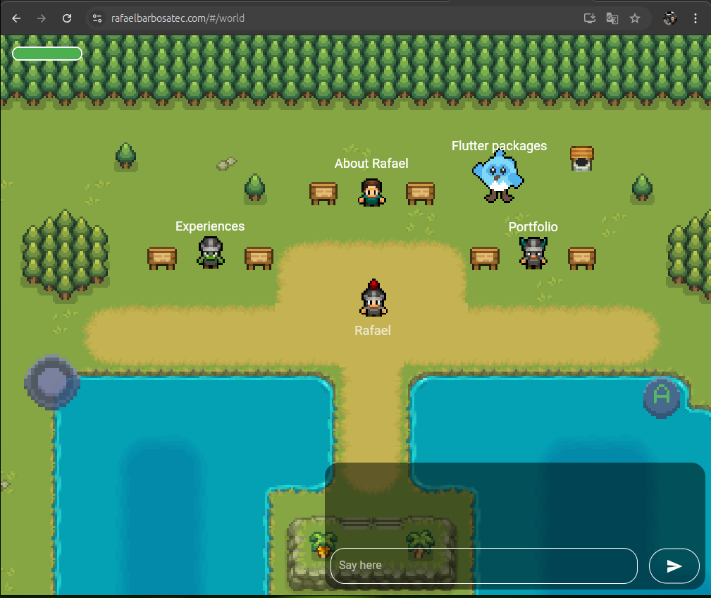

# Bonfire Awesome

Welcome to the Bonfire Awesome repository. Here you can find various examples of games built using the Bonfire framework.

## Games
| Preview | Name | Short Description | Github | Stores |
|--------------|-----------|--------------|--------------|--------------|
|  | rafaelbarbosatec | This is my official website | - | [Site](https://rafaelbarbosatec.com/) |
|  | Darkness Dangeus | The first RPG game made with flutter. Game that gave rise to Bonfire | [Link](https://github.com/RafaelBarbosatec/darkness_dungeon) | - |
|  | Flappy Bird | Copy of famous game FlappyBird | [Link](flappy_bird) | - |

Feel free to explore the code and learn how to create your own games using Bonfire!
