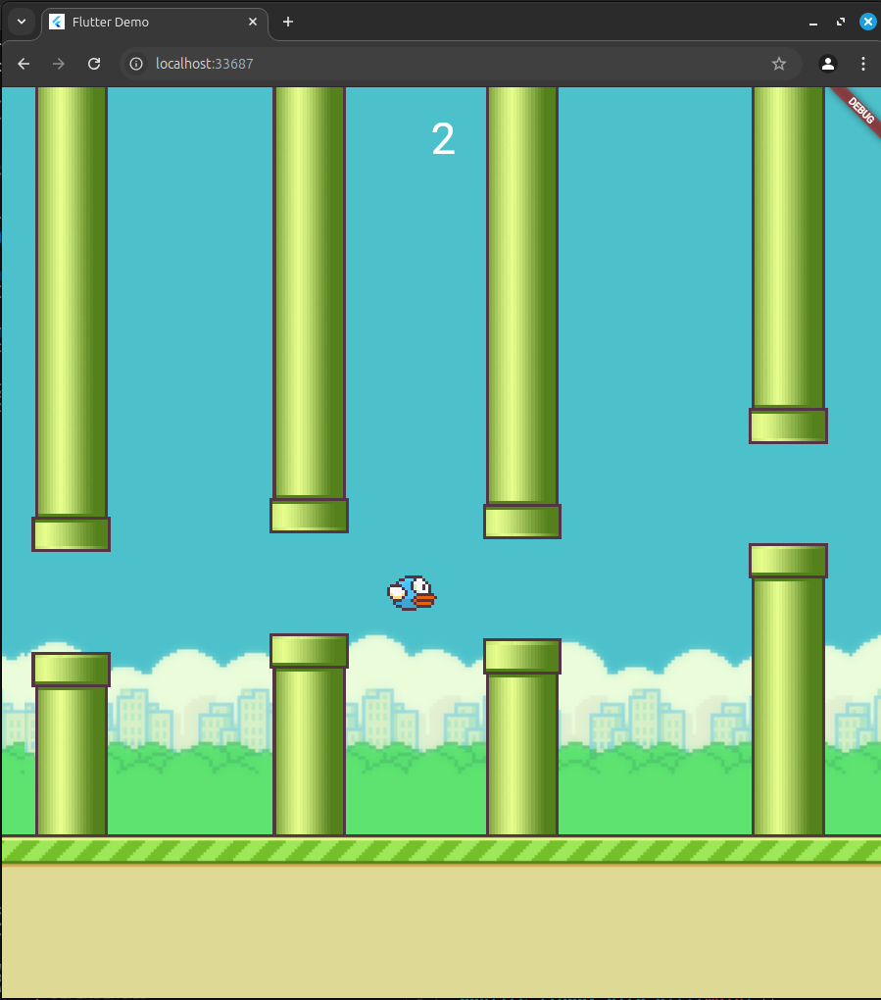

# Bonfire Game Examples

Welcome to the Bonfire game examples repository. Here you can find various examples of games built using the Bonfire framework.

## Games

| Preview | Name |
|--------------|-----------|
|  | [Darkness Dangeus](https://github.com/RafaelBarbosatec/darkness_dungeon) |
|  | [Flappy Bird](flappy_bird) |
|  | [Example 3](./path/to/example3) |

Feel free to explore the code and learn how to create your own games using Bonfire!
